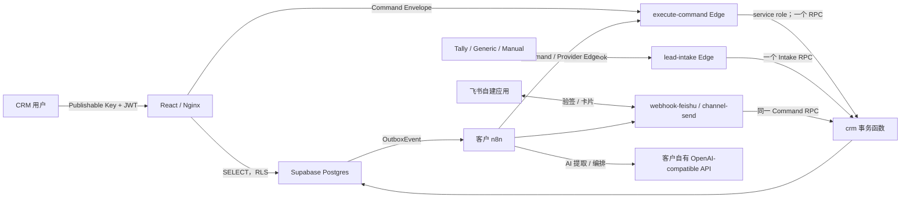

# 架构说明

## 部署单元

每家客户一套：

- 客户 Supabase Project：Auth、Postgres、RLS、Vault、Storage、Edge Functions。
- 客户 VPS：`frontend-nginx`、`n8n`、独立 `n8n-postgres` 和持久化卷。
- 客户飞书自建应用。
- 客户阿里云百炼或其他 OpenAI-compatible 账户。

系统不提供跨客户共享数据库或共享 Secret。`organization_id` 不是让不同客户共库，而是部署内的强安全边界与未来兼容层。

## 数据流原则

1. Intake 先验签、归一化为 `LeadIntakeV1`、原子持久化，再返回 `202`；AI 故障不丢线索。
2. 浏览器读操作由 RLS 决定；URL 或请求体中的 organization ID 不是授权依据。
3. 每个核心命令同一事务写业务记录、Activity、Audit、CommandExecution 与 Outbox。
4. n8n 允许读取必要上下文，只能通过 Command/Provider Edge 改变核心业务状态。
5. Manual Provider 永远返回人工动作要求；只有用户确认真实发送后才写 `messages.status=sent`。
