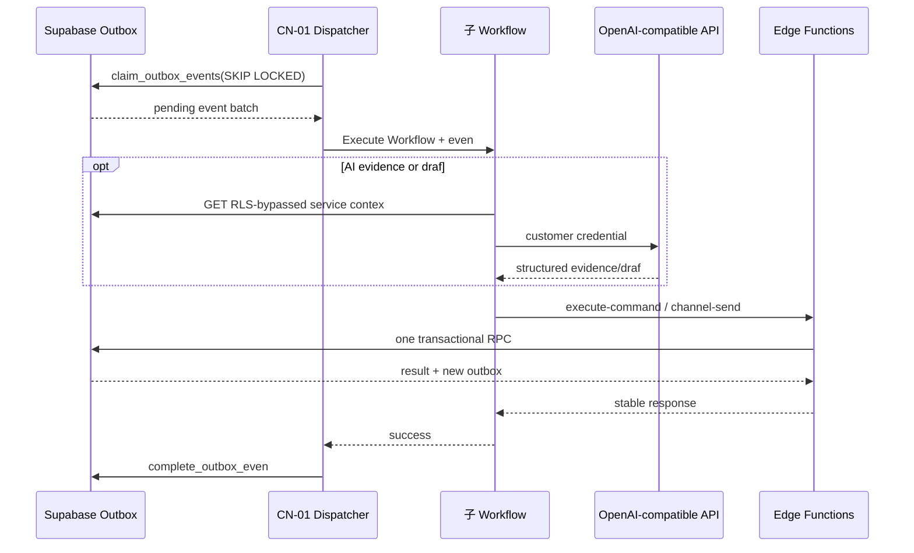

# n8n 调用图

失败执行由 CN-10 写 `automation_runs`；处理中的事件 15 分钟后恢复，超过最大尝试进入 dead letter。未知但合法事件由 Dispatcher 直接完成，防止队列永久卡死。当前 mapping：Intake → Score → Assignment → Draft → Feishu，Reminder → Feishu，Purge → Edge worker。

日报与清理是受控 schedule：日报只读指标并调用 Feishu；Retention 只调用 `crm.run_retention_cleanup`；Reminder Enqueuer 只调用 `crm.enqueue_due_automation_events`。
