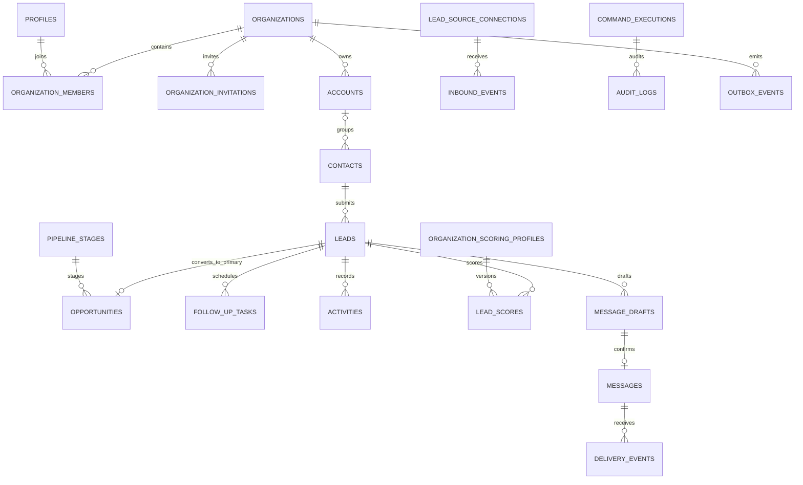

# Schema / ERD

## 核心不变量

- 所有企业业务表包含 `organization_id` 与时间戳；可并发修改记录包含 `version`。
- 一个 deployment 最多一个未删除的 primary organization；开发 seed 的组织 B 为 `is_primary=false`。
- 每组织最多一个 active Owner、一个 default pipeline stage、一个 active scoring profile。
- verified phone/email 在组织内唯一；姓名相同不触发自动合并。
- Lead 可重复产生但 30 天内相同 verified Contact + 相同来源 + 相同需求会合并 metadata；不同需求创建新 Lead。
- 每条 Lead 最多一个 primary Opportunity；转换不删除 Lead。
- `follow_up_tasks` 是未来，`activities` 是事实；兼容 `follow_ups` 只是只读 view。
- unknown score 保存 `score=null`，不计入 known weight。
- Intake 和 Command 分别由组织范围唯一幂等键约束。
- `organization_invitations` 记录 Auth/数据库两阶段邀请状态与幂等键，不保存邀请邮件正文或 Secret；组织最终清除时级联删除。
